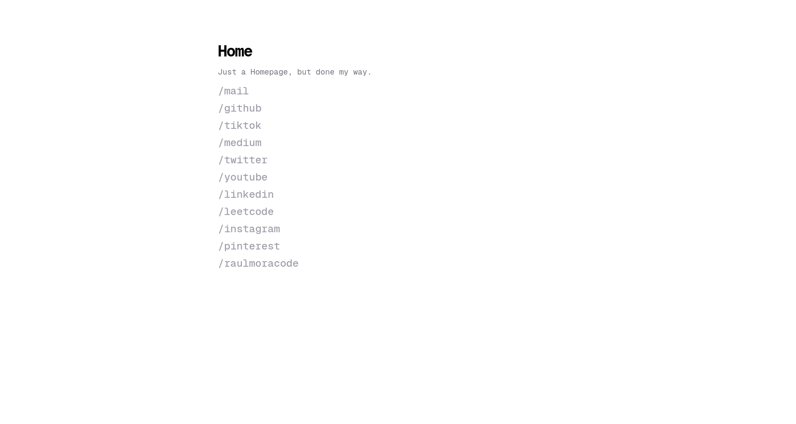

# Bookmarks / ChromePage

A minimal browser new-tab experience built with **Vite**, **React**, **TypeScript**, and **Tailwind CSS**. It works as a personal link hub and browser extension landing page.



## Requirements

- **Node.js** 20 or newer
- **pnpm** recommended

## Installation

1. Clone the repository:

   ```bash
   git clone https://github.com/raulmoracode/Bookmarks.git
   cd Bookmarks
   ```

2. Install dependencies:

   ```bash
   pnpm install
   ```

   If you prefer `npm`, you can use:

   ```bash
   npm install
   ```

## Development

Start the local development server with:

```bash
pnpm dev
```

Then open the URL shown in the terminal, usually:

```bash
http://localhost:5173
```

## Production Build

Generate the optimized extension bundle with:

```bash
pnpm build
```

This creates the production files inside the `dist/` folder.

## Load the Extension in Chrome

1. Open `chrome://extensions`
2. Enable **Developer mode**
3. Click **Load unpacked**
4. Select the generated `dist/` folder

## Load the Extension in Firefox

1. Open `about:debugging#/runtime/this-firefox`
2. Click **Load Temporary Add-on**
3. Select the `manifest.json` file inside the generated `dist/` folder

## Project Structure

- `src/App.tsx` — application entry component
- `src/components/Pagebase.tsx` — main page layout
- `src/const/info.ts` — link data and content configuration
- `public/` — static assets, including `manifest.json` and fonts

## Available Scripts

- `pnpm dev` — start the Vite development server
- `pnpm build` — type-check and build the project for production
- `pnpm preview` — preview the production build locally
- `pnpm lint` — run ESLint across the project

## Tech Stack

- React 19
- TypeScript
- Vite
- Tailwind CSS 4

## Author

Raúl Mora  
contact@raulmoracode.com
